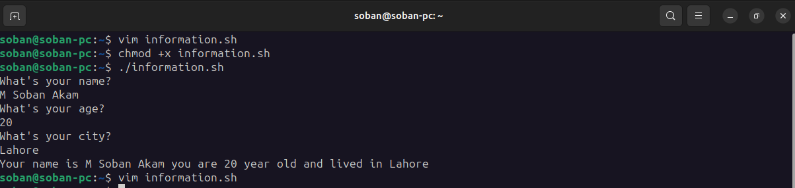

# Basic Shell Script

- Create a simple script which will take two command line arguments and  then multiply them together

  

- Create a simple script, which will ask the user for a few pieces of  information then combine this into a message which is echo'd to the screen.

  
  

- Now Mr. Tom suddenly lost the track of his current location. Help him find his location.

  He wants the list of all files present on home directory.

  He is done with the task and he is happy with your work. He want to  display a thankyou message.

  
